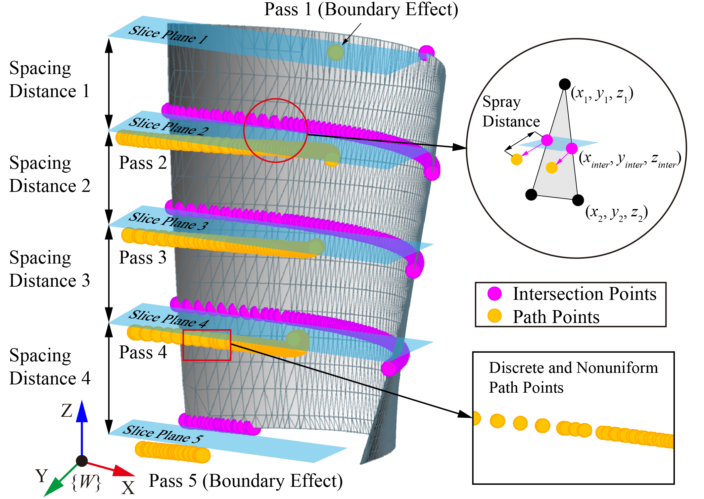
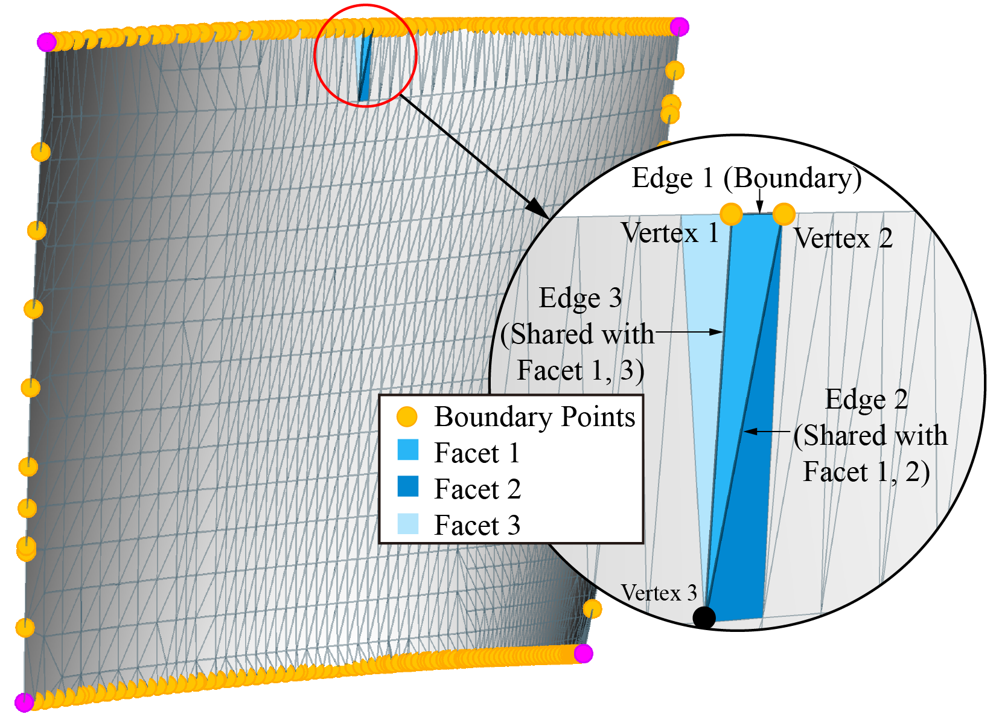
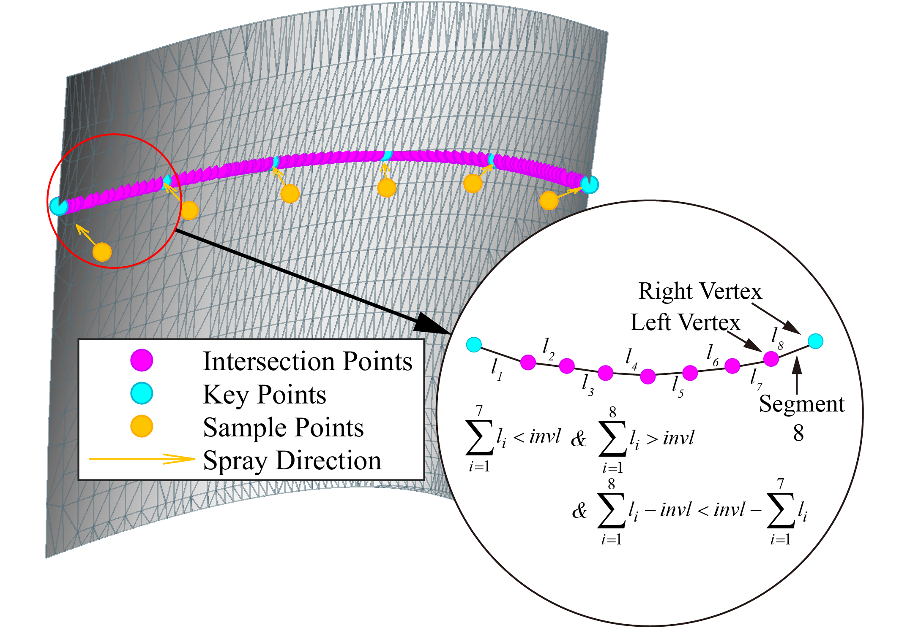
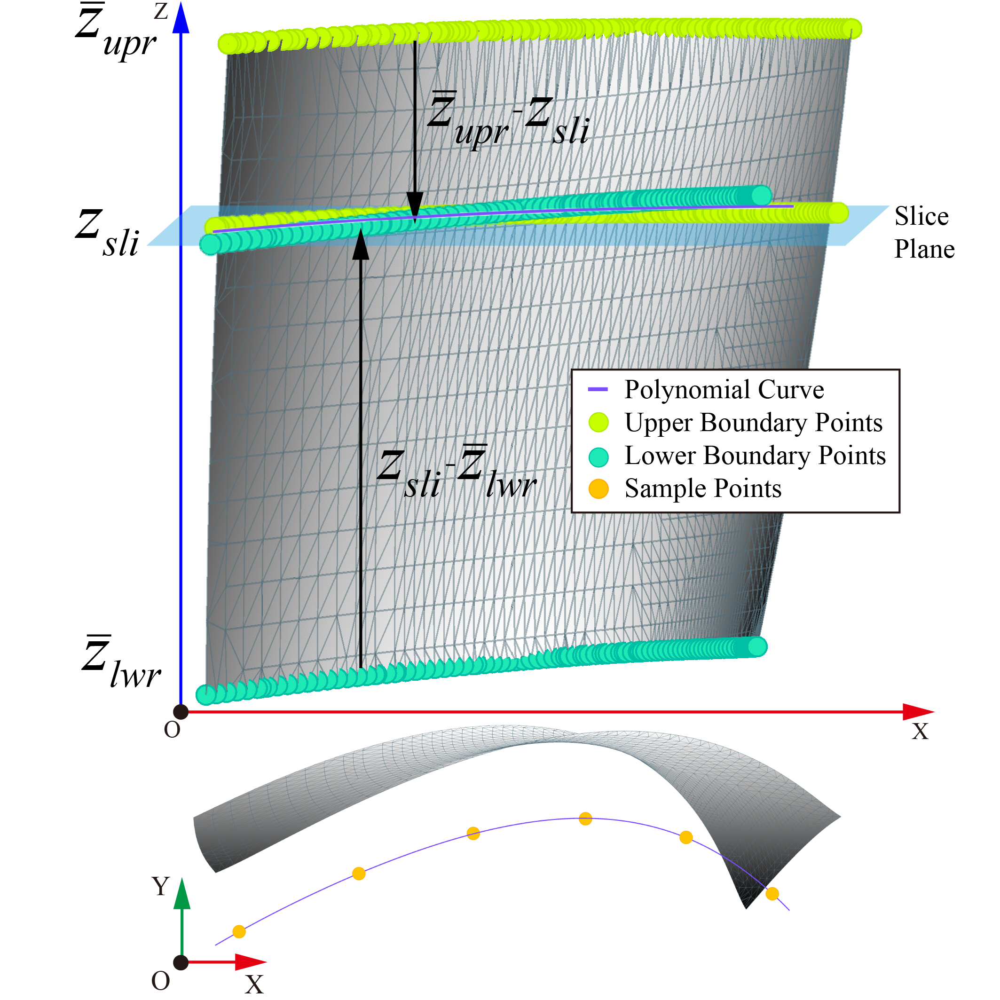
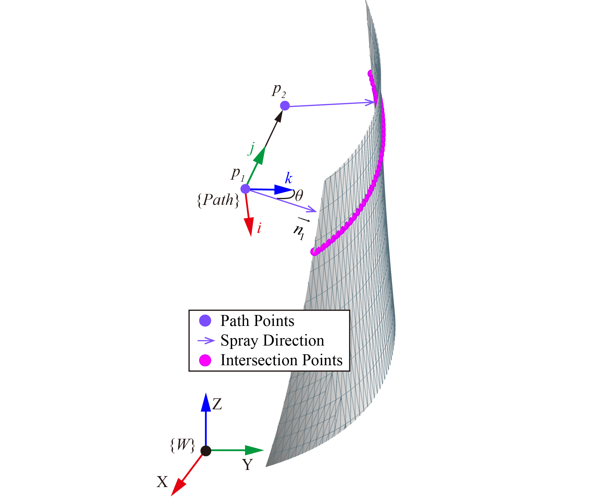
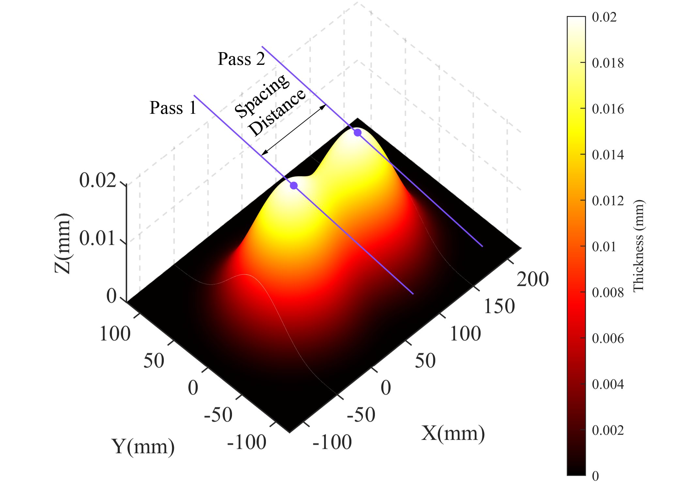
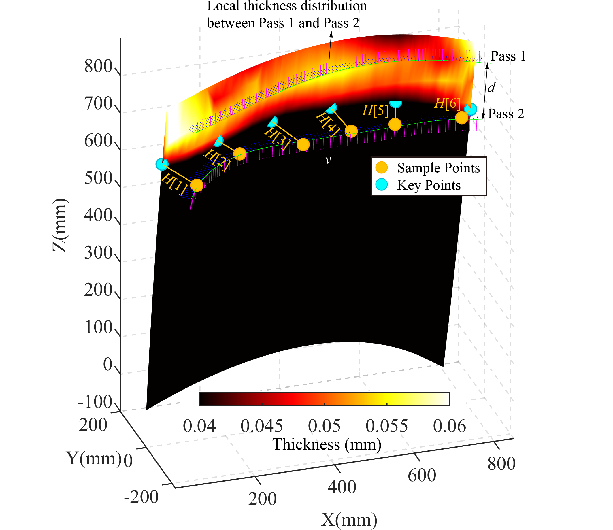
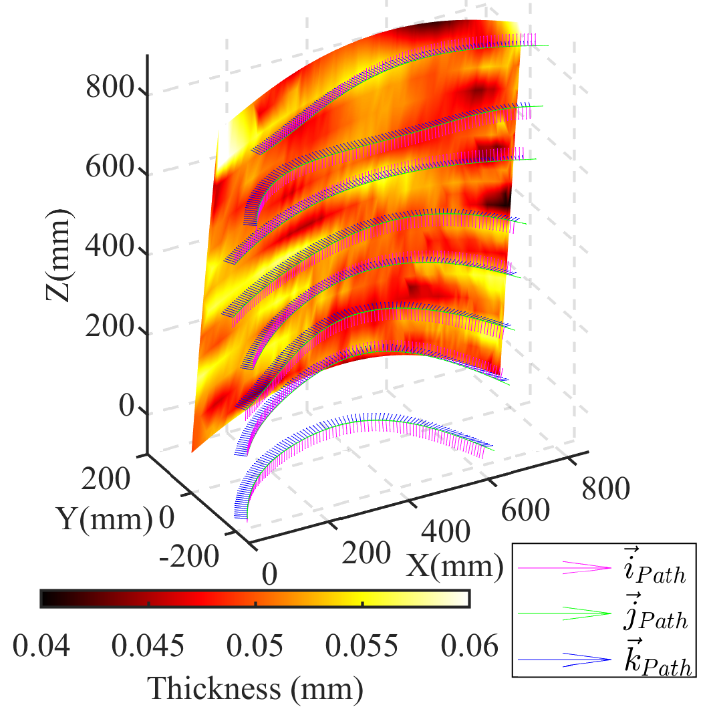

# Robotic Spray Painting Path Planning for Complex Surface: Boundary Fitting Approach
## Paper
[Robotic Spray Painting Path Planning for Complex Surface: Boundary-Fitting Approach](https://www.cambridge.org/core/journals/robotica/article/robotic-spray-painting-path-planning-for-complex-surface-boundary-fitting-approach/DF42E26DA6C84C782DCABE47D7A99B4D)
## Abstract
Currently, most of the robot path planning methods for spray painting are based on slicing the CAD model of the target surface to generate a series of path points. They usually neglect the geometric boundary of the model and the smoothness of the generated path, leading to a non-uniform coating thickness. 

To ameliorate it, an improved "boundary fitting approach" is proposed. In this method, the upper and lower boundaries of the target surface are firstly detected based on the topology of the STereoLithography (STL) model. 

  
  

For each pass, several sample points are extracted with a uniform length interval from the intersection points generated by the basic slicing method. 

The path pass is then described by a fourth-order polynomial curve. It fits the boundary points and sample points for the *z*-*t* and *y*-*t* relationships, respectively. 

  

Based on the spray gun's motion direction and spray direction, the orientation of each path point is also defined. 

  
  

The parameters of the path pass are optimized by Particle Swarm Optimization (PSO) to get the optimal uniformity of the resulting coating thickness. Both of the global uniformity and the local uniformity between two adjacent passes are considered. 

  

The strength of the proposed approach is validated by comparing the simulation with the basic and other typical algorithms. The results denote that boundary fitting approach could improve the uniformity of coating thickness. It brings about a better performance for the painted workpiece.

  
  

